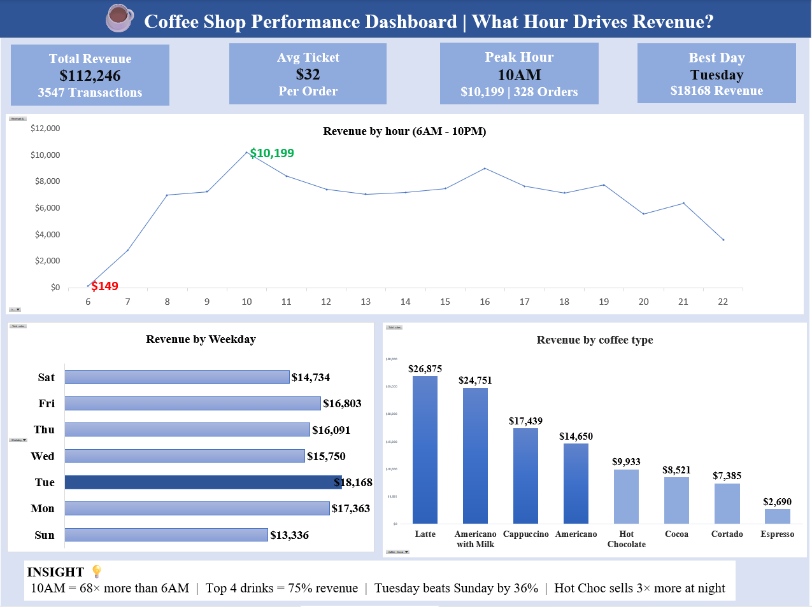

## 📊 Dashboard Preview



| Metric | Value |
|---|---|
| 💰 Total Revenue | $112,246 |
| 📋 Total Orders | 3,547 |
| 🎯 Average Ticket | $31.65 |
| ⏰ Peak Hour | 10 AM — $10,199 |
| 📅 Best Day | Tuesday — $18,168 |
| 📉 Slowest Day | Sunday — $13,336 |
| 💳 Payment Method | 100% Card |

---

## 📌 Project Overview
* Excel analysis of 3,547 coffee shop transactions — uncovering a **68× revenue difference** between peak and slowest hour using PivotTables, heat maps and data storytelling. Built entirely on ** Microsoft Excel.** 

This project analyzes one year of coffee shop transaction data to answer key business questions:

- **When** do customers spend the most? (hourly & time block patterns)
- **What** drives the most revenue? (product mix analysis)
- **Which days** perform best? (weekly trend analysis)
- **How** do drinks perform across different times of day? (cross-dimensional analysis)

---

## 🔍 Key Findings

### ⏰ Hourly Revenue
- **Peak hour is 10 AM** at $10,199 — 68× higher than the slowest hour (6 AM, $149)
- A **second peak at 4 PM** ($9,032) reveals a strong afternoon coffee habit
- Late night (10 PM) trails at $3,635 with the smallest order count (113)
- Night customers spend **more per visit** ($33 avg) than morning ($30 avg)

### ☕ Product Mix
- **Top 4 drinks generate 75%** of all revenue ($83,715 of $112,246)
  - Latte — $26,875 (24%)
  - Americano with Milk — $24,751 (22%)
  - Cappuccino — $17,439 (16%)
  - Americano — $14,650 (13.1%)
- **Espresso is the weakest** at just $2,690 (2.4% share)
- **Latte has the highest avg ticket** ($36) vs Espresso at $21

### 🌅 Time Block Patterns
| Block | Hours | Revenue | Orders | Avg Ticket |
|---|---|---|---|---|
| Morning | 6 AM – 11 AM | $35,929 | 1,181 | $30 |
| Afternoon | 12 PM – 5 PM | $38,130 | 1,205 | $32 |
| Night | 6 PM – 10 PM | $38,186 | 1,161 | **$33** |

> Revenue is nearly equal across all 3 blocks — but **Night has the highest avg ticket**, meaning fewer but higher-value orders.

### 📅 Weekly Trends
- **Tuesday is the strongest day** ($18,168) — 36% above the weakest day
- **Sunday is the slowest** at $13,336

### 🔀 Cross-Dimensional Insight
- **Americano with Milk dominates mornings** ($10,026) — nearly double its afternoon figure ($7,384)
- **Hot Chocolate triples at night** ($5,290 vs $1,744 morning) — strong evening comfort-drink pattern
- Latte performs consistently strong across all time blocks

---

## 📋 Summary Table

| Finding | The Numbers | What This Means |
|---|---|---|
| 6 AM sales very low | $149 vs $10,199 at 10 AM | Only 0.1% of daily revenue |
| Morning favourite drink | Americano with Milk $10,026 | Clear morning customer preference |
| Top 4 drinks dominate | 75% of all sales | Focus menu strategy here |
| Tuesday beats Sunday | $18,168 vs $13,336 | $5,000 gap between best and worst day |
| Night = highest ticket | $33 vs $30 morning | Evening customers spend more per visit |
| Hot Choc triples at night | $5,290 vs $1,744 | Strong evening comfort drink pattern |

---

## ⚠️ Limitations

> This analysis covers **revenue only**. Staff costs, rent, and ingredient costs were not available in the dataset.
>
> - High-revenue hours ≠ high-profit hours
> - Whether 6 AM is worth operating cannot be determined without cost data
> - Profit calculations require a separate cost dataset

---

## 📐 Methodology

1. **Raw data** — 3,547 transactions with hour, coffee name, weekday, time block, date
2. **PivotTables** — grouped by hour, product, weekday and time block
3. **Cross analysis** — 2D pivot (Time Block × Coffee Type) to find interaction patterns
4. **Performance bars** — REPT formula for visual bars inside cells without charts
5. **Heat map** — conditional formatting color scale on cross analysis
6. **Dashboard** — KPI cards + 3 charts + insight boxes built on single sheet

---

## 📁 Files Included

```
📦 coffee-sales-analysis/
├── 📊 Coffe_sales_FINAL.xlsx      # Final Excel with dashboard + all PivotTables
├── 🖼️  Dashboard_Image.png         # Dashboard screenshot
└── 📄 README.md                    # This file
```

### Sheets Inside Excel
| Sheet | Description |
|---|---|
| ☕ Coffee Sales Dashboard | KPI cards + 3 charts + key insights |
| ⏰ Revenue by Hour | 17 hours with time block colors + performance bar |
| ☕ Top 4 Coffee Drinks | 8 drinks ranked by revenue + category tags |
| 📅 Revenue by Weekday | Mon–Sun with best/worst day highlighted |
| 🕐 Time Block Analysis | Morning vs Afternoon vs Night comparison |
| 🔀 Cross Dimensional Analysis | Heat map — Time Block × Coffee Type |
| 📋 Sales Data | 3,547 raw transactions |

---

## 🛠️ Tools Used

| Tool | Purpose |
|---|---|
| Microsoft Excel (Free) | Data storage, PivotTables, charting, dashboard |
| Excel PivotTables | Grouping & summarizing by hour, product, weekday |
| Excel Charts | Line chart (hourly), bar charts (product & weekday) |
| Conditional Formatting | Heat map for cross dimensional analysis |

---

## 🚀 How to Use

1. **Clone or download** this repository
2. Open `Coffe_sales_FINAL.xlsx` in Microsoft Excel
3. Start with **Coffee Sales Dashboard** sheet for the full picture
4. Explore individual pivot sheets for detailed analysis
5. Each pivot sheet has an **insight box** at the bottom explaining the key finding

---


